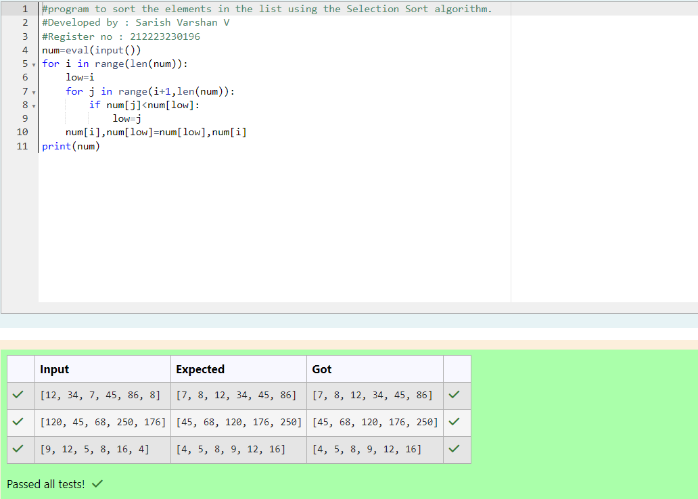
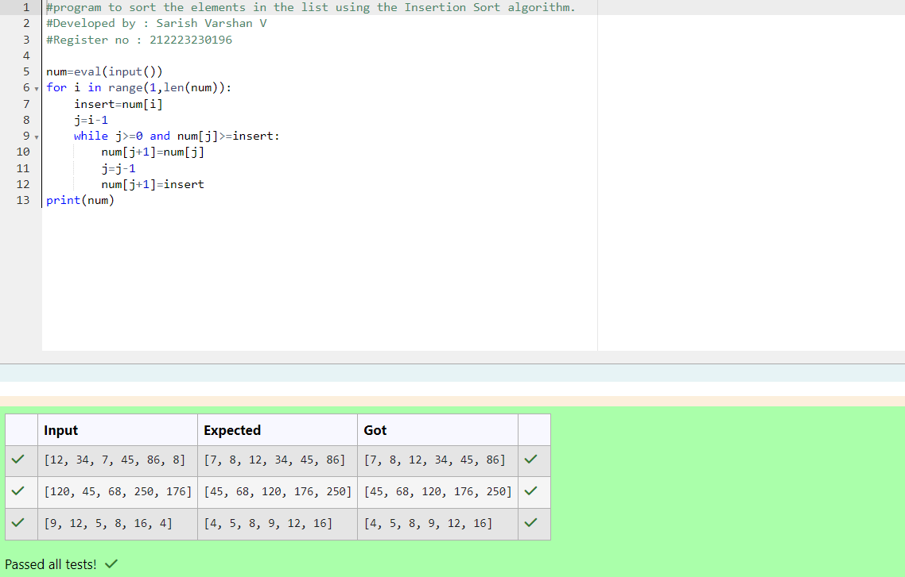

# Selection sort and Insertion sort
## Aim:
To write a program to perform selection sort and insertion sort using python programming.
## Equipment’s required:
1.	Hardware – PCs
2.	Anaconda – Python 3.7 Installation / Moodle-Code Runner
## Algorithm:
## Selection Sort Algorithm:
1.	Set the first unsorted element as the minimum
2.	For each of the unsorted elements, check if the element < current minimum.
3.	If yes, set the element as the new minimum.
4.	Swap minimum with first unsorted position.
5.	Repeat the steps 2 and 3 for all the elements in the array.
## Insertion Sort Algorithm:
1.	Set the first element as sorted element j.
2.	For each unsorted element X, check if current sorted element j >X.
3.	If yes, move sorted element to the right by 1.
4.	Break the loop and insert X.
5.	Repeat the steps 2 to 4 for sorting all the elements in the array.
## Program:
i)	#Selection Sort
```
Unsorted=eval(input())
def selsort(Unsorted):
  n = len(Unsorted)
  for i in range(n-1):
    min_pos = i
    for j in range(i,n):
      if Unsorted[j]<Unsorted[min_pos]:
        Unsorted[j],Unsorted[min_pos] = Unsorted[min_pos],Unsorted[j]
  return Unsorted
print(selsort(Unsorted))


```
ii)	#Insertion Sort
```
def Insertionsort(arr):
  for i in range(1,len(arr)):
    j = i
    while arr[j]<arr[j-1] and j>0:
      arr[j],arr[j-1] = arr[j-1], arr[j]
      j-=1
  return arr
arr = eval(input())
print(Insertionsort(arr))


```

## Output:






## Result:
Thus the program is written to perform selection sort and insertion sort using python programming.
